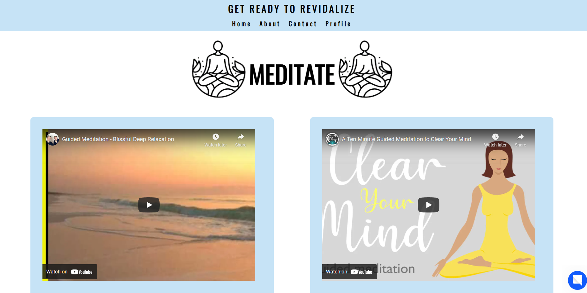

# Ctrl-Intelligence-
### Team members:
- Maryam Mosleh
- Rahmot Afolabi
- Eve Nicole
- Joanna Park
- Nicholas Smith

--------------------------------------------

## Idea of this project:
- Name of the Web App: **Get Ready To Revidalize**

Many apps will help the users to  unplug from work or school by closing the app or remind the user that they have spent their allowed
time on this app, but they don't provide suggestions on how to unplug from your work or study.
The point of our app it to provide the reminder, suggestions on what to do when you unplug  and a chat bot that will 
help you with deciding what to do when you want 
to disconnect from your busy life.

- This Web app consists of a navigation bar that contains **Home**, **About**, **Contact** and **Profile** pages.

- **About** page talks about who made this Web app, what's the point behind it, why ReVidalize and what is it 
exactly to help the user with figuring out what is this Web App about and may answer any questions they might have

- **Contact Us** page is in case the user wants to contact the people who have created this Web App and this could be
to ask a question or general feedback.

- **Profile** page represents the user details, so first and last names, how many hours have the user spent using this app and hence
off screen time and how many hours has the user spent on each suggestion.

- **Home** page is when you first open the Web app, has 6 buttons that represent the activities that are suggested 
for the user to do, these activities are:

  - **Meditate** page, which shows video suggestions for the video to meditate to.

  - **Cook** page recommends different recipes for the user to try and once the user clicks on the recipe the link
will take the user to the website that talks about the recipe in more details.

  - **Read** page shows a different story every time the user opens it which will encourage the user to read a short story to 
help them relax and have a good time.

  - **Create** page basically focus on the creative side of the user, and it suggests a different activity for the user every time
the user refresh the page, for example like drawing.

  - **Nature** suggests doing an activity that is related to nature and there's a video attached too for nature's sounds.

  - **Random** page will generate a random activity for th user from the activities that were mentioned above which will an excitment factor
to the user with deciding which activity to do.

### The chat bot
What makes this Web app even more special is that it has a chat bot that will help the user with deciding which activity
to do out of all of them.

The name of the bot is Adeline

, 

The user talks with Adeline Bot by choosing their answer or typing it out, and they can talk to it again in case they want a 
different activity than the one that was suggested or to change the recipe for the food they want to cook.

